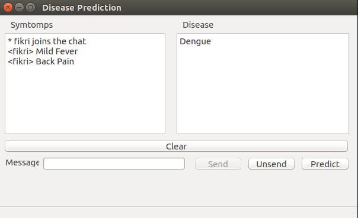

# Disease-Predict-Classification

This repo is purpose for making prediction for disease from symptomps input. Using PyQt5 GUI for interfacing.
We train the model using keras nerural network using tensorflow backend. The train result is 95 % for accuray.
Just follow this instruction to running this program.

**Dialog**



**Prediction**
```
python dialog.py
```
**Training**
```
python train.py
```
